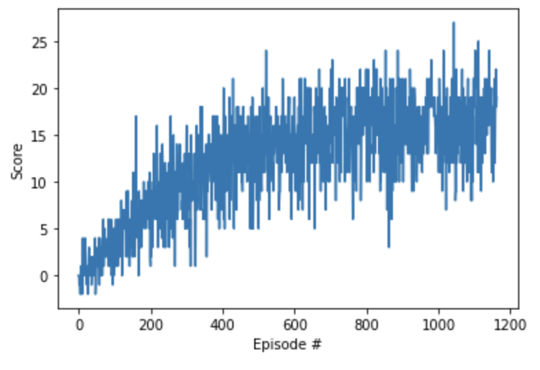

## Report

---

### Problem description

The idea of this agent is to capture all the yellow bananas avoiding the blue ones. The state space has 37 dimensions, the agent has 4 actions (walk forward, backward, left or right) and it receives +1 point when he get a yellow banana and -1 when he get a blue.

### Learning Algorithm

The learning algorithm use to solve the problem was Deep Q-learning an algorithm use to solve Markov Decision Process based on the following article https://storage.googleapis.com/deepmind-media/dqn/DQNNaturePaper.pdf.

The hyperparameters used for the algorithm are the following:

- n_episodes (int): max 1500
- max_t (int): 1000
- eps_start (float): 1.0
- eps_end (float): 0.01
- eps_decay (float): 0.995

Additionally for the agent, the hyperparameters are:

- BUFFER_SIZE = int(1e5) 
- BATCH_SIZE = 64       
- GAMMA = 0.99       
- TAU = 1e-3          
- LR = 5e-4           
- UPDATE_EVERY = 4   

### Training

For the training we set as the score goal 16.5, reaching that score in the 1063 episode, with an average score of 16.51

Which results in the following behaviour of the model

Additionally for that test, it was achived an score of 16.0

---

### Ideas for future work

In order to improve the model I can adjust in a better way the hyperparameters, additionally i can check another techniques of Reinforcement learning that can have a better performance to this kind of problems and apply it to the project.